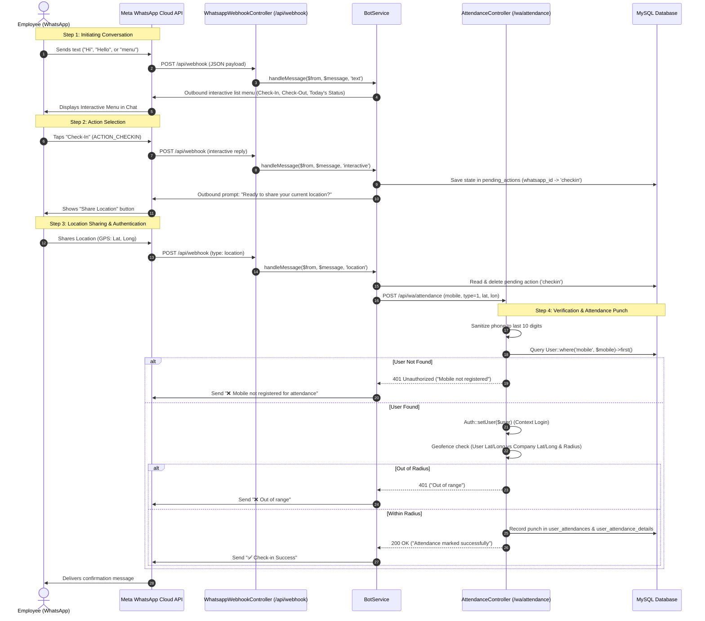

# WhatsApp Attendance & "Login" Workflow and Meta Business Setup Guide

> **Project:** Urpayroll  
> **Target Systems:** `Uppayroll_website_server` (Laravel Backend) & `Uppayroll_android` (Flutter Mobile App)

---

## 1. Executive Summary & Clarification

In the Urpayroll ecosystem, **"WhatsApp Login"** refers to **WhatsApp-based Employee Identification and Attendance Punch-in / Punch-out (Daily Login / Logout)**.

* **Android App (`Uppayroll_android`):**  
  The Flutter mobile app **does not** contain any WhatsApp login, OTP, or OAuth button. Authentication in the mobile app is strictly handled via Company Username, Mobile/Email, Password, Device ID, and FCM Token.
* **Backend Server (`Uppayroll_website_server`):**  
  Contains a complete **WhatsApp Chatbot Attendance System** using the **Meta (Facebook) WhatsApp Cloud API**. Employees "log in" and punch their daily attendance directly within WhatsApp by texting the bot and sharing their GPS location.

---

## 2. Architecture & Complete End-to-End Workflow



---

## 3. Detailed Codebase & File Breakdown

The entire WhatsApp workflow is housed inside `Uppayroll_website_server`. Below are the exact files and how each line functions:

### 1. Routes Definition
* **File:** [`Uppayroll_website_server/routes/api.php`](file:///d:/Uppayroll_16March24_all_update/Uppayroll_android_new/Uppayroll_website_server/routes/api.php#L20-L45)

```php
// Webhook endpoint called by Meta Cloud API (GET for handshake verification, POST for messages)
Route::match(['get', 'post'], '/webhook', [WhatsappWebhookController::class, 'handle']);

// Internal API endpoint called by BotService to record attendance punch
Route::post('/wa/attendance', [AttendanceController::class, 'wa_check_in_out']);

// Internal API endpoint called by BotService to get today's work hours & status
Route::get('/wa/status', [AttendanceController::class, 'todayStatus']);
```

---

### 2. Webhook Controller (The Gateway)
* **File:** [`Uppayroll_website_server/app/Http/Controllers/WhatsappWebhookController.php`](file:///d:/Uppayroll_16March24_all_update/Uppayroll_android_new/Uppayroll_website_server/app/Http/Controllers/WhatsappWebhookController.php)

```php
namespace App\Http\Controllers;

use Illuminate\Http\Request;
use Illuminate\Support\Facades\Log;
use App\Services\Whatsapp\BotService;

class WhatsappWebhookController extends Controller
{
    public function handle(Request $request, BotService $bot)
    {
        // 1. Meta Webhook Verification Handshake (GET Request)
        if ($request->isMethod('get')) {
            if ($request->hub_mode === 'subscribe'
                && $request->hub_verify_token === env('WHATSAPP_VERIFY_TOKEN')) {
                return response($request->hub_challenge, 200);
            }
            return response('Invalid verify token', 403);
        }

        // 2. Incoming WhatsApp Message / Event (POST Request)
        $payload  = $request->json()->all();
        $message  = $payload['entry'][0]['changes'][0]['value']['messages'][0] ?? null;
        if (!$message) {
            return response()->noContent();
        }

        $from = $message['from'];           // Sender's WhatsApp phone number (e.g. 919876543210)
        $type = $message['type'];           // 'text', 'interactive', or 'location'

        // Dispatch to bot processor
        $bot->handleMessage($from, $message, $type);

        return response()->noContent();
    }
}
```

---

### 3. Bot Conversation & State Management Service
* **File:** [`Uppayroll_website_server/app/Services/Whatsapp/BotService.php`](file:///d:/Uppayroll_16March24_all_update/Uppayroll_android_new/Uppayroll_website_server/app/Services/Whatsapp/BotService.php)

#### Key Responsibilities:
1. **Tracks Pending User Intent**: Stores whether the user clicked "Check-In" or "Check-Out" using the `PendingAction` model in the database:
   ```php
   private function savePending(string $waId, string $action): void
   {
       PendingAction::updateOrCreate(
           ['whatsapp_id' => $waId],
           ['action' => $action]
       );
   }
   ```
2. **Interactive Replies**: Listens for button clicks (`ACTION_CHECKIN`, `ACTION_CHECKOUT`, `ACTION_STATUS`):
   ```php
   match ($id) {
       'ACTION_CHECKIN'  => $this->savePending($from, 'checkin')
                              & $this->wa->sendLocationButtons($from),

       'ACTION_CHECKOUT' => $this->savePending($from, 'checkout')
                              & $this->wa->sendLocationButtons($from),

       'ACTION_STATUS'   => $this->clearPending($from)
                              & $this->sendTodayStatus($from),
       ...
   };
   ```
3. **Location Handling & Phone Normalization**:
   When the user sends their location (`$type === 'location'`), it strips non-digit characters and normalizes the number to the **last 10 digits** so country code differences do not break matching:
   ```php
   /* 1. Extract digits only */
   $digits = preg_replace('/\D+/', '', $from);      // e.g., "918777507693"

   /* 2. Keep last 10 digits */
   $mobile = strlen($digits) > 10 ? substr($digits, -10) : $digits; // "8777507693"

   /* 3. Call internal attendance endpoint */
   $resp = $this->callAttendanceApi($mobile, $action, $lat, $lon);
   ```

---

### 4. Meta Outbound API Client
* **File:** [`Uppayroll_website_server/app/Services/Whatsapp/WhatsappApi.php`](file:///d:/Uppayroll_16March24_all_update/Uppayroll_android_new/Uppayroll_website_server/app/Services/Whatsapp/WhatsappApi.php)

Sends JSON messages to `https://graph.facebook.com/v15.0/{PHONE_NUMBER_ID}/messages` using HTTP Bearer Token authentication:
* `sendText($to, $body)`: Sends plain text messages.
* `sendList($to)`: Sends interactive menu with sections and selectable options.
* `sendLocationButtons($to)`: Sends quick-reply buttons instructing the user to share their location.

---

### 5. Authentication & Attendance Verification ("Login")
* **File:** [`Uppayroll_website_server/app/Http/Controllers/Api/AttendanceController.php`](file:///d:/Uppayroll_16March24_all_update/Uppayroll_android_new/Uppayroll_website_server/app/Http/Controllers/Api/AttendanceController.php#L864-L1230)

Method: `wa_check_in_out(Request $request)`

```php
public function wa_check_in_out(Request $request)
{
    // 1. Validate payload: mobile, type (1 = in, 2 = out), latitude, longitude
    $validator = Validator::make($request->all(), [
        'mobile'    => 'required|digits_between:8,15',
        'type'      => 'required|in:1,2',
        'latitude'  => 'required|numeric',
        'longitude' => 'required|numeric',
    ]);
    ...

    // 2. USER AUTHENTICATION: Match user by mobile number
    $user = \App\Models\User::where('mobile', $request->mobile)->first();

    if (!$user) {
        return response()->json([
            'status'  => false,
            'message' => 'Mobile not registered for attendance',
            'data'    => [],
        ], 401);
    }

    // 3. SET USER IN AUTH CONTEXT (Logging user in)
    Auth::setUser($user);

    // 4. GEOFENCE CHECK: Compare user coordinates against company coordinates
    $company_data = \App\Models\Company::find($user->company_id);
    $is_valid_location = isLocationWithinRadius(
        $latitude,
        $longitude,
        $company_data->latitude,
        $company_data->longitude,
        $company_data->radius
    );

    if (!$is_valid_location) {
        return response()->json([
            'status'  => false,
            'message' => __('attendance.out_of_range'),
            'data'    => [],
        ], 401);
    }

    // 5. SHIFT & ATTENDANCE RECORDING
    // - Looks up assigned ShiftAllotment
    // - Checks for night shifts, rest days, holidays
    // - Inserts or updates user_attendances and user_attendance_details
    ...
    return response()->json([
        'status'  => true,
        'message' => 'Attendance punched successfully',
    ]);
}
```

---

### 6. Database Table Schema for State Tracking
* **Model:** [`Uppayroll_website_server/app/Models/PendingAction.php`](file:///d:/Uppayroll_16March24_all_update/Uppayroll_android_new/Uppayroll_website_server/app/Models/PendingAction.php)
* **Table:** `pending_actions`

```sql
CREATE TABLE `pending_actions` (
  `id` bigint(20) unsigned NOT NULL AUTO_INCREMENT,
  `whatsapp_id` varchar(255) NOT NULL,
  `action` varchar(50) NOT NULL,
  `created_at` timestamp NULL DEFAULT NULL,
  `updated_at` timestamp NULL DEFAULT NULL,
  PRIMARY KEY (`id`),
  UNIQUE KEY `pending_actions_whatsapp_id_unique` (`whatsapp_id`)
) ENGINE=InnoDB DEFAULT CHARSET=utf8mb4 COLLATE=utf8mb4_unicode_ci;
```

---

## 4. Meta Business & WhatsApp Cloud API Setup Guide

To get this WhatsApp bot functioning, follow these exact setup steps in the Meta Developer Portal and Meta Business Manager.

### Step 1: Create a Meta Developer Account & App
1. Go to [developers.facebook.com](https://developers.facebook.com/) and log in with your Facebook account.
2. Click **My Apps** > **Create App**.
3. Select **Other** > **Business** as the App Type.
4. Give your app a name (e.g. `Urpayroll Attendance Bot`) and connect it to your **Meta Business Portfolio / Account**.

---

### Step 2: Add WhatsApp to the App
1. On the App Dashboard, find **WhatsApp** in the list of products and click **Set up**.
2. Go to **WhatsApp** > **API Setup** on the left navigation bar.
3. Meta will provide:
   * **Test Phone Number**
   * **Phone Number ID** (e.g. `589192560954298`)
   * **WhatsApp Business Account ID**
   * **Temporary Access Token** (valid for 24 hours)

---

### Step 3: Generate a Permanent System User Token
> ⚠️ **CRITICAL:** The temporary access token expires after 24 hours. For production, you **must** create a Permanent System User Token in Meta Business Manager.

1. Open [business.facebook.com/settings](https://business.facebook.com/settings).
2. Under **Users**, click **System Users**.
3. Click **Add**, name the system user (e.g. `urpayroll-api`), and set the role to **Admin**.
4. Click **Add Assets**:
   * Under **Apps**, select your app (`Urpayroll Attendance Bot`) and toggle **Full Control (Manage App)**.
5. Click **Generate New Token**:
   * Select your app.
   * Under Token Expiration, choose **Never**.
   * Under Permissions, select:
     * `whatsapp_business_messaging`
     * `whatsapp_business_management`
6. Copy the generated permanent token immediately.

---

### Step 4: Configure Webhook in Meta Dashboard
1. On the left menu of the Meta Developer App dashboard, expand **WhatsApp** > **Configuration**.
2. Next to **Webhook**, click **Edit**:
   * **Callback URL:** `https://www.urpayroll.com/api/webhook` *(Must be an active HTTPS URL reachable by Meta)*.
   * **Verify Token:** Set your secret verify token (e.g. `myverifytoken` or a random secure string).
3. Click **Verify and Save**. Meta will send a `GET` request to your server. `WhatsappWebhookController` will validate it against `WHATSAPP_VERIFY_TOKEN` and return the handshake challenge.
4. Under **Webhook fields**, click **Manage**:
   * Find **`messages`** and click **Subscribe**.

---

### Step 5: Configure `.env` on Your Server
Open `Uppayroll_website_server/.env` and configure the following parameters:

```env
# Meta Graph API Base URL
WHATSAPP_API_URL=https://graph.facebook.com

# Permanent System User Access Token from Meta Business Manager
WHATSAPP_API_TOKEN=EAAOZAxjEqvxMBO...

# WhatsApp Phone Number ID from WhatsApp > API Setup
WHATSAPP_PHONE_NUMBER_ID=589192560954298

# Webhook Verify Token configured in Step 4
WHATSAPP_VERIFY_TOKEN=myverifytoken

# Your Server Base URL (with trailing slash)
API_BASE=https://www.urpayroll.com/
```

After updating `.env`, clear your Laravel configuration cache:
```bash
php artisan config:clear
php artisan cache:clear
```

---

### Step 6: Link a Real Business Phone Number (For Production)
1. In Meta Developer Portal under **WhatsApp** > **API Setup**, scroll down to **Step 5: Add a phone number**.
2. Click **Add Phone Number**.
3. Enter your business name, time zone, and category.
4. Enter the real phone number you want to use for the bot (Note: The number must **not** be currently registered with the regular WhatsApp or WhatsApp Business mobile app; if it is, delete the account in the phone app first).
5. Verify the number via SMS or Voice call OTP.
6. Replace the `WHATSAPP_PHONE_NUMBER_ID` in `.env` with the new phone number ID provided by Meta.

---

## 5. End-to-End Testing Procedure

### Test 1: Webhook Handshake Verification
Run this command from any terminal to ensure your server properly responds to Meta's webhook handshake:
```bash
curl -i -X GET "https://www.urpayroll.com/api/webhook?hub.mode=subscribe&hub.challenge=1158201444&hub.verify_token=myverifytoken"
```
**Expected Response:** HTTP 200 with body `1158201444`.

### Test 2: WhatsApp Chat Test
1. Make sure the testing employee exists in the `users` table:
   * `mobile`: Must match the tester's 10-digit mobile number (e.g., `9876543210`).
   * `company_id`: Must point to an active company with `latitude`, `longitude`, and `radius` set.
   * `status`: Active (`1`).
2. Open WhatsApp and send **"Hi"** to your WhatsApp bot number.
3. The bot responds with the interactive menu:
   * **Check-In**
   * **Check-Out**
   * **Today's Status**
4. Tap **Check-In**. The bot responds: *"Ready to share your current location?"*.
5. Tap the paperclip 📎 (attachment) icon in WhatsApp > select **Location** > send **Share Current Location**.
6. The bot evaluates your GPS coordinates against the company geofence and replies:
   * `✅ Attendance marked successfully` (if within radius), or
   * `❌ You are out of office range` (if outside radius).
